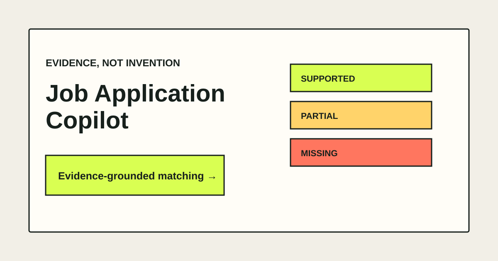

# Job Application Copilot

An evidence-grounded resume and job-description matcher. It identifies which requirements are
supported, partially supported, or missing—and refuses to invent experience that is not present in
the resume.

> **Milestone 3:** This repository contains a transparent deterministic baseline, a versioned
> evaluation suite, and an optional structured-output LLM pipeline. The baseline remains available
> without an API key and provides the comparison point for every AI-powered version.

## Why this project exists

Many resume assistants generate polished text without checking whether each claim is supported.
That creates a real risk for applicants. This project treats resume content as evidence: every
positive assessment must cite resume text, while missing experience must remain explicitly missing.

## Current features

- Paste resume and job-description text
- Import text-based PDF resumes up to 5 MB
- Extract job requirements using a transparent baseline
- Classify each requirement as `supported`, `partial`, or `missing`
- Cite matching resume evidence
- Validate structured API responses with Pydantic
- Run a golden-dataset evaluation in CI
- Compare classification, retrieval, citation, and safety metrics across data splits
- Run semantic requirement analysis with schema-validated LLM output
- Reject unknown citations and logically inconsistent model responses
- Record the model and prompt version used for every LLM analysis
- Configure provider timeout and retry behaviour
- Run locally or with Docker without an API key

## Demo



## Architecture

```text
PDF / pasted resume ──> text extraction ──> evidence units ─┐
                                                            ├─> matcher ─> validated result ─> UI
Job description ──────> requirement extraction ─────────────┘
```

The next milestone will add and compare BM25, vector, hybrid, and reranked retrieval while preserving
the same schemas and golden dataset.

## Baseline results

The versioned synthetic dataset contains 32 manually labelled cases split into development,
validation, and held-out test sets. Current held-out results are:

| Metric | Result |
|---|---:|
| Classification accuracy | 80.0% |
| Macro F1 | 80.2% |
| Evidence Recall@5 | 71.4% |
| Citation precision | 100.0% |
| False-supported rate | 0.0% |

See the [full baseline report](evaluation/baseline_report.md), including per-class metrics and the
confusion matrix. These results describe this dataset only; they are not claims about real-world
accuracy.

## Run locally

Install [uv](https://docs.astral.sh/uv/), then:

```bash
uv sync --dev
uv run uvicorn app.main:app --reload
```

Open <http://localhost:8000>. API documentation is available at
<http://localhost:8000/docs>.

### Enable optional LLM analysis

The deterministic baseline is always available. To enable paid LLM analysis, copy `.env.example` to
`.env`, add your own OpenAI API key, and set:

```dotenv
OPENAI_API_KEY=your-key-here
OPENAI_MODEL=gpt-5-mini
OPENAI_TIMEOUT_SECONDS=30
OPENAI_MAX_RETRIES=2
LLM_ANALYSIS_ENABLED=true
```

The key is loaded only from the environment or the ignored `.env` file. Never commit it. The LLM
pipeline uses the official OpenAI SDK's structured-output parser with a Pydantic schema.

Alternatively, use Docker:

```bash
docker compose up --build
```

## Verify the project

```bash
uv run ruff check .
uv run pytest --cov=app
uv run python -m evaluation.run_evaluation --check
```

The evaluation command checks versioned minimum and maximum quality thresholds, so regressions fail
the GitHub Actions workflow.

To run a paid LLM experiment on the validation split:

```bash
uv run python -m evaluation.run_llm_evaluation --split validation --write-report
```

Use `validation` while selecting prompts or models. Run the held-out `test` split only after the
configuration is frozen.

## API example

```bash
curl -X POST http://localhost:8000/api/analyze \
  -H 'Content-Type: application/json' \
  -d '{
    "resume_text": "Software Engineer. Built Python APIs used by three internal teams.",
    "job_description": "Required: professional experience building Python API services."
  }'
```

## Roadmap

- [x] Evidence-grounded deterministic baseline
- [x] Structured output validation
- [x] PDF text extraction
- [x] Golden dataset and CI quality gate
- [x] Expand and manually label the evaluation dataset
- [x] Add development, validation, and held-out test splits
- [x] Add classification, retrieval, citation, and safety metrics
- [x] Freeze baseline regression thresholds
- [x] Add optional LLM structured analysis
- [x] Add Pydantic grounding invariants and citation validation
- [x] Add prompt and model version metadata
- [x] Add configurable timeout and transient-request retries
- [x] Add an LLM evaluation runner using the same golden dataset
- [ ] Add full-text and vector retrieval baselines
- [ ] Compare vector, hybrid, and reranked retrieval
- [ ] Add request tracing, latency, token, and cost metrics
- [ ] Deploy a public demo

## Responsible-use note

Do not upload resumes containing information you are not authorised to process. Review all output
before using it in an application. The copilot should improve how genuine experience is communicated,
not manufacture qualifications or employment history.

## License

MIT
